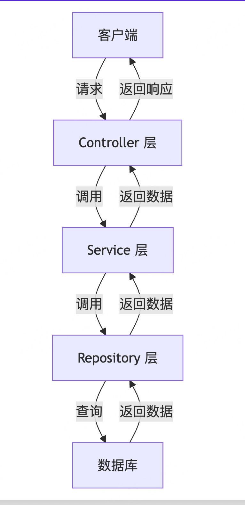
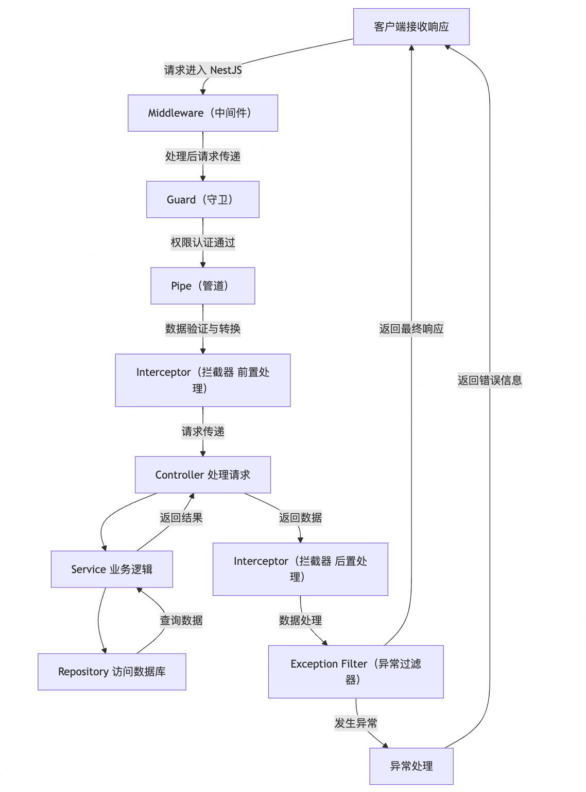

# IOC

Inverse of Control（控制反转）
后端都是面向对象的开发方式，拿 nestjs 举例：

- 1、Controller 对象：接收 http 请求，调用 Service，返回响应
- 2、Service 对象：实现业务逻辑
- 3、Repository 对象：实现对数据库的增删改查
- 4、DataSources 数据库链接对象
- 4、Config 对象
  这些对象直接都有关系，比如`Controller`对象依赖`Service`实现逻辑，`DataSources`对象又要从`Config`拿到数据库的信息等等。  
  你在用`Controller`对象之前，需要先实例化`Service`对象，各种前后顺序，依赖关系，如果人为保证的话，很容易乱。IOC 就是解决这个依赖问题。

## IOC 原理

IOC 原理就是把创建对象，处理对象之间的依赖关系等，放到了框架层面去处理，我们在写代码的时候，只要声明清楚相关的对象，对象之间的依赖关系就行。能干成这件事，就依赖上一节讲的`装饰器`。

```ts
// 指定路由前缀user
@Injectable()
export class UserService {
  getHello() {
    return "hello wrold";
  }
}

@Controller("user")
export class UserController {
  // 注入UserService
  @Inject(UserService)
  private readonly userService: UserService;

  // 申明一个register路由，访问/user/register是返回success
  @Post("register")
  register(@Body() registerUser: any) {
    return this.userService.getHello();
  }
}
```

如果要自己写，实现同样的功能代码如下：

```ts
const express = require("express");

const app = express();
const port = 3001;

class UserService {
  getHello() {
    return "hello wrold";
  }
}

class UserController {
  prefix;
  userService;
  constructor(prefix) {
    this.prefix = prefix;
  }

  userService = new UserService();

  register() {
    return this.userService.getHello();
  }
}
const userController = new UserController("/user");
app.post(`${userController.prefix}/register`, (req, res) => {
  console.log("register", userController.register());
  res.send(userController.register());
});

app.listen(port, () => {
  console.log("服务已启动");
});
```

上面代码只是一个简单的还原，正常会封装一下，比这个好点，但是也能看出和使用`IOC`的`nest`区别，不用`IOC`的话你需要自己去关注什么时候`new`对象，对象的前后顺序等，而使用`nestjs`你只需要声明清楚依赖关系，`nestjs`背后会根据装饰器里的数据，去进行依赖关系的处理，对象的`new`等。这就是`IOC`的作用。java 里的注解也是这个。

# AOP

`nestjs`还有个重要的概念叫`AOP`，Aspect Oriented Programming 面相切面编程。个人的理解就是在你正常的执行逻辑中间插入一些`API`方便你进行一些额外的操作。

一个请求打到后端，`nestjs`流程一般是这样，


`AOP`呢，就是在整个流程的前，中，后给你机会插入一下通用的代码，用于统一鉴权，统一拦截请求，或者统一返回格式等等。


## Middleware

可以用于请求预处理，日志记录等，目前好像没怎么用过这个。

## Guard

路由守卫，一般是用于判断权限的，用于调用 Controller 前进行权限校验，比如登录校验，权限校验，角色校验等。返回 true 代表放行，false 拦截。

```ts
import { CanActivate, ExecutionContext, Injectable, UnauthorizedException } from "@nestjs/common";
import { Observable } from "rxjs";

@Injectable()
export class LoginGuard implements CanActivate {
  canActivate(context: ExecutionContext): boolean | Promise<boolean> | Observable<boolean> {
    const request: Request = context.switchToHttp().getRequest();
    if (!authorization) {
      throw new UnauthorizedException("用户未登录");
    }
    return true; // true: 放行  false：拦截
  }
}

// 使用方法
@UseGuards(LoginGuard)
```

## Pipe

主要用于一些请求到达 Controller 前的参数的校验，具体用法如下：

```ts
import { ArgumentMetadata, BadRequestException, Injectable, PipeTransform } from "@nestjs/common";

@Injectable()
export class ValidatePipe implements PipeTransform {
  transform(value: any, metadata: ArgumentMetadata) {
    if (Number.isNaN(parseInt(value))) {
      throw new BadRequestException(`参数${metadata.data}错误`);
    }

    return typeof value === "number" ? value * 10 : parseInt(value) * 10;
  }
}
```

`nestjs`内置了一些`Pipe`，具体如下：

- ValidationPipe:
  - 用于验证请求参数是否符合预期的格式和规则。
  - 可以自动根据 DTO 类中的装饰器进行验证。
- ParseIntPipe:
  - 将请求参数转换为整数类型。
  - 如果转换失败，会抛出一个 BadRequestException。
- ParseBoolPipe:
  - 将请求参数转换为布尔类型。
  - 支持的值包括 true, false, 1, 0 等。
- ParseArrayPipe:
  - 将请求参数转换为数组类型。
  - 可以指定数组元素的类型和验证规则。
- ParseUUIDPipe:
  - 将请求参数转换为 UUID 类型。
  - 如果转换失败，会抛出一个 BadRequestException。
- DefaultValuePipe:
  - 为请求参数提供默认值。
  - 如果参数不存在，则使用默认值。

## Interceptor

可以在调用 Controller 前后，分别加入一些处理逻辑，可以统一返回的数据格式，示例如下：

```ts
import { CallHandler, ExecutionContext, Injectable, NestInterceptor } from "@nestjs/common";
import { Response } from "express";
import { map, Observable } from "rxjs";

@Injectable()
export class FormatResponseInterceptor implements NestInterceptor {
  intercept(context: ExecutionContext, next: CallHandler): Observable<any> {
    // 调用前的处理逻辑写这里
    const request = context.switchToHttp().getRequest();

    // 调用Controller前，给header添加数据（这只是个举例）
    request.headers["userInfo"] = {
      username: "张三",
      password: "123456",
    };
    const response = context.switchToHttp().getResponse<Response>();

    return next.handle().pipe(
      map((data) => {
        // 调用next.handle()就会调用Controller，之后的.pipe()就是调用Controller之后的处理逻辑了。
        return {
          code: response.statusCode,
          message: "success",
          data,
        };
      })
    );
  }
}
```

我感觉这个和`Middleware`差不多，但是它可以通过 context 拿到 Controller（context.getClass(), context.getHandler()），所以能做一些更负责的事情。

## ExceptionFilter

AOP 执行中允许抛出异常，会被 ExceptionFilter 捕获，之后做一些统一的异常处理，然后返回给客户端。

```ts
import { ArgumentsHost, Catch, ExceptionFilter, HttpException, HttpStatus } from "@nestjs/common";
import { Response } from "express";

@Catch(HttpException)
export class CustomExceptionFilter implements ExceptionFilter {
  catch(exception: HttpException, host: ArgumentsHost) {
    const response = host.switchToHttp().getResponse<Response>();
    response.statusCode = exception.getStatus();

    const res = exception.getResponse() as { message: string[] };

    response
      .json({
        code: -1,
        message: "请求失败",
        data: res?.message?.join ? res?.message?.join(",") : exception.message,
      })
      .end();
  }
}
```

# 总结

`Nestjs`中这种`AOP`架构的好处是方便把通用逻辑抽离出来，而且通过装饰器这种方式，很好的实现了解耦。  
比如说有些接口需要登录验证，有些接口不需要，比如登录，注册接口不需要登录，而获取用户信息这种接口，就需要登录，使用 AOP+装饰器的方式就很好的解耦了登录逻辑。代码如下：

```ts
// login.guard.ts
import { CanActivate, ExecutionContext, Injectable, UnauthorizedException } from "@nestjs/common";
import { Observable } from "rxjs";

@Injectable()
export class LoginGuard implements CanActivate {
  canActivate(context: ExecutionContext): boolean | Promise<boolean> | Observable<boolean> {
    const request: Request = context.switchToHttp().getRequest();
    if (!authorization) {
      throw new UnauthorizedException("用户未登录");
    }
    return true; // true: 放行  false：拦截
  }
}

// user.controller.ts
import { Controller, Get, Post } from "@nestjs/common";
import { LoginGuard } from "./login.guard";

@Controller("user")
export class UserController {
  @Get("info")
  @UseGuards(LoginGuard) // 需要登录验证的，就加这个装饰器，不需要的就不加，这样是否登录，就和业务逻辑拆开了
  info() {
    // todu
  }

  @Post("login")
  login() {
    // todu
  }

  @Post('register')
  register() {
    // todu
  }
}
```
